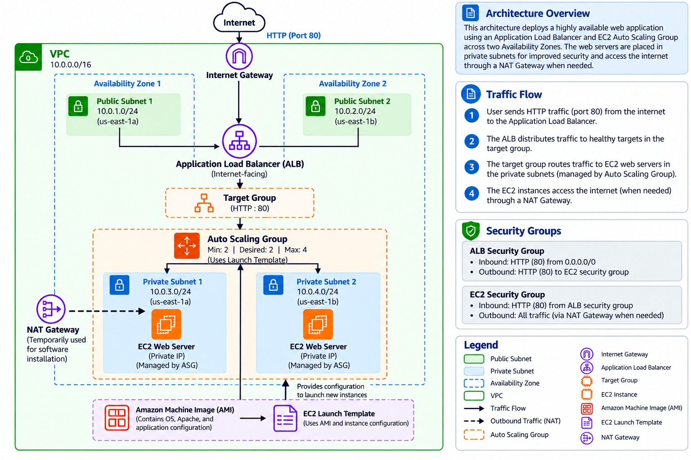

# Highly Available AWS Web Application

## Project Overview

This project demonstrates the design and deployment of a highly available and scalable web application infrastructure on Amazon Web Services (AWS).

The application is being deployed across multiple Availability Zones using public and private subnets. An internet-facing Application Load Balancer distributes incoming HTTP traffic to EC2 web servers hosted in private subnets, providing a secure foundation for high availability and fault tolerance.

## Project Goals

- [x] Build a custom AWS VPC
- [x] Configure public and private subnets across multiple Availability Zones
- [x] Configure route tables and internet connectivity
- [x] Deploy an EC2 web server in a private subnet
- [x] Configure an internet-facing Application Load Balancer
- [x] Configure an ALB target group and health checks
- [x] Apply security groups to control traffic between the ALB and EC2
- [x] Configure temporary NAT Gateway access for EC2 software installation
- [ ] Deploy a second EC2 web server in another Availability Zone
- [ ] Implement EC2 Auto Scaling
- [ ] Deploy an Amazon RDS database
- [ ] Configure monitoring with Amazon CloudWatch
- [ ] Test high availability and fault tolerance
- [ ] Complete architecture documentation and diagram

## Architecture
The current architecture uses an internet-facing Application Load Balancer as the public entry point for the application. The ALB is deployed across public subnets in two Availability Zones and forwards HTTP traffic to a target group.

The EC2 web server is deployed in a private subnet and does not accept HTTP traffic directly from the internet. Its security group allows HTTP traffic from the ALB security group.

Current traffic flow:

Internet → Internet Gateway → Application Load Balancer → Target Group → EC2 Web Server

A second EC2 web server will be deployed in a private subnet in another Availability Zone to provide redundancy at the application layer.

### Current Architecture Diagram

## AWS Services

### Currently Implemented

- Amazon VPC
- Amazon EC2
- Application Load Balancer (ALB)
- Elastic Load Balancing Target Groups
- Internet Gateway
- NAT Gateway (temporarily used for EC2 outbound internet access)
- Security Groups
- Route Tables

### Planned

- EC2 Auto Scaling
- Amazon RDS
- Amazon CloudWatch
- Amazon Route 53

## Project Status

🚧 In Progress
